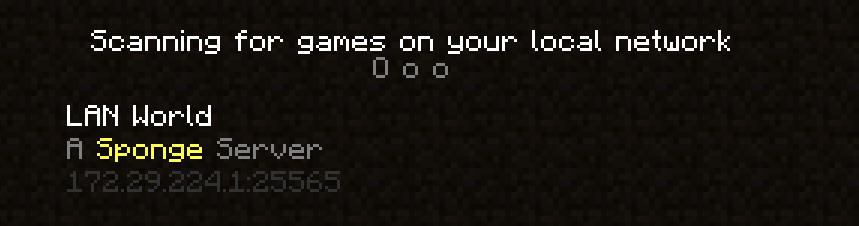

# LanDiscovery 

LanDiscovery is a plugin for SpongeAPI 8+ that broadcasts a dedicated server's presence for discovery in the LAN server list on clients.

The text used for the broadcast is the MOTD set in the server's `server.properties`. This is currently not configurable.

## Commands

- `/lanmute`

  **Permission**: `landiscovery.mute`
  
  This command will toggle whether lan broadcasts are enabled, to temporarily hide the server from local clients.

## License

LanDiscovery is released under the terms of the [GNU Lesser General Public License version 3 or later](COPYING.LESSER).

## Developer resources
- https://github.com/SpoutDev/Vanilla/blob/master/src/main/java/org/spout/vanilla/protocol/LANThread.java Implementation of server broadcast

The is `[MOTD]server mothd[/MOTD][AD]port#[/AD]` -- server ip is the same as the broadcasting host.

### Building

LanDiscovery is built with Gradle, and targets Java 8. Run `./gradlew build` to compile and test the plugin. The built jar will be in `build/libs`.
